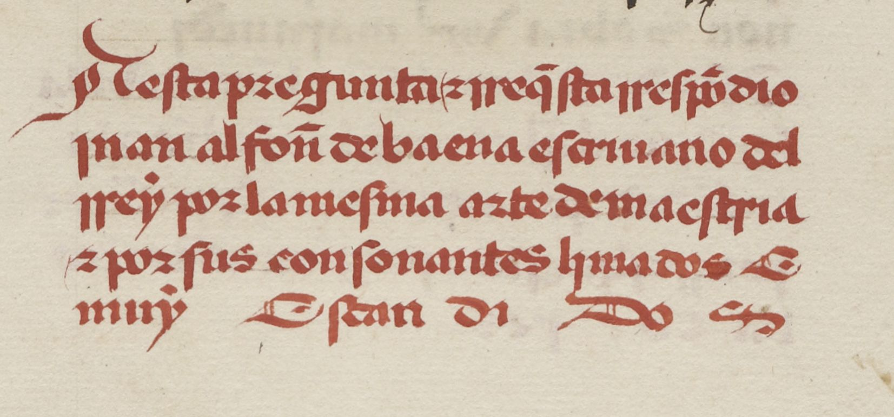
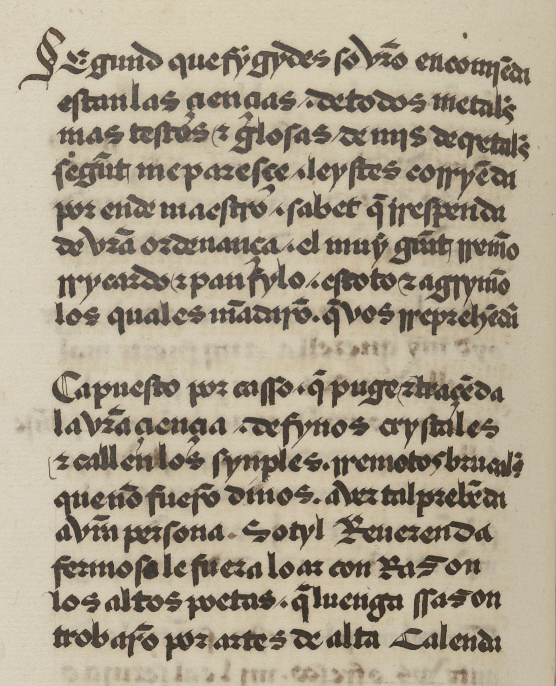
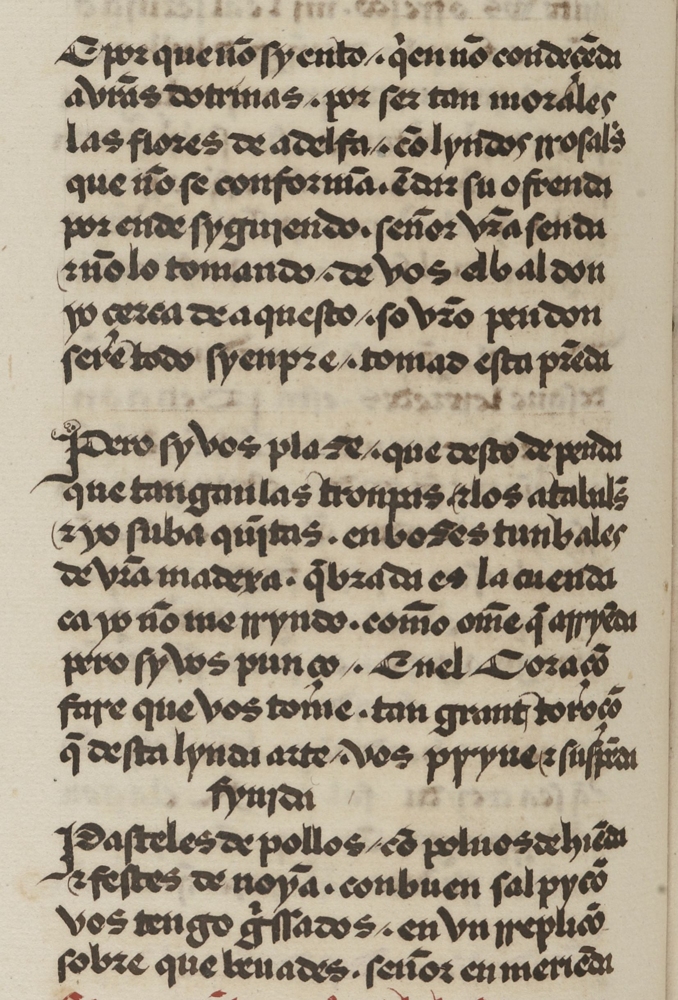

Rubrica: A esta pregunta e requesta respondió Juan Alfonso de Baena, escrivano del rey, por la mesma arte de maestria e por sus consonantes limados e muy escandidos

    Segund que fingides so vuestro encomienda
    están las ciencias de todos metales,
    mas testos e glosas de mis decretales,
    segunt me paresce leistes corrienda,
    por ende, maestro, sabet que respenda
    de vuestra ordenança el muy grant remón,
    Ricardo e Pánfilo, Escoto e Agrimón,
    los cuales mandaron que vos reprenda.

    Ca puesto por caso que puge e trascenda
    la vuestra ciencia de finos cristales,
    e callen los simples remotos brucales,
    que non fueron dinos aver tal prevenda,
    a vuestra persona sotil reverenda,
    fermoso le fuera loar con razón,
    los altos poetas que luenga sazón
    trovaron por artes de alta calenda.

    E porque non siento quien non condescenda
    a vuestras dotrinas por ser tan morales
    las flores de adelfa con lindos rosales,
    que non se conforman en dar su ofrenda,
    por ende siguiendo, señor, vuestra senda,
    e non lo tomando de vos el baldón,
    yo cerca de aquesto so vuestro pendón, 
    seré todo siempre, tomad esta prenda.

    Pero si vos plaze que desto dependa
    que tangan las trompas e los atabales
    e yo suba quintas en bozes tumbales
    “de vuestra madexa quebrada es la cuenda”,
    ca yo non me rindo como omne que arrienda,
    pero si vos punçó en el coraçón
    faré que vos tome tan grant toroçón
    que desta linda arte vos prive e suspenda.

    Pasteles de pollos con polvos de hienda,
    e festes de noya con buen salpicón
    vos tengo guissados en un replicón
    sobre que vevades, señor, en merienda.

<dl>
    <dt>Autor</dt>
    <dd>Juan Alfonso de Baena</dd>
    <dt>Editor/a</dt>
    <dd>Gimena del Rio</dd>
    <dt>Repositorio</dt>
    <dd>Biblioteca Nacional de Francia</dd>
    <dt>Identificador</dt>
    <dd>Dutton 1223</dd>
    <dt>Localización manuscrito</dt>
    <dd>29v</dd>
    <dt>Fecha composición</dt>
    <dd>1426-1465</dd>
</dl>

