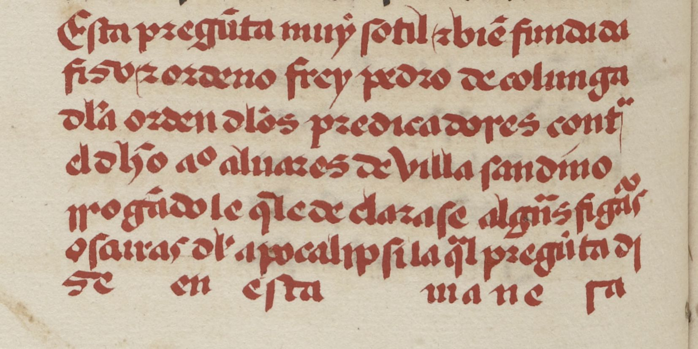
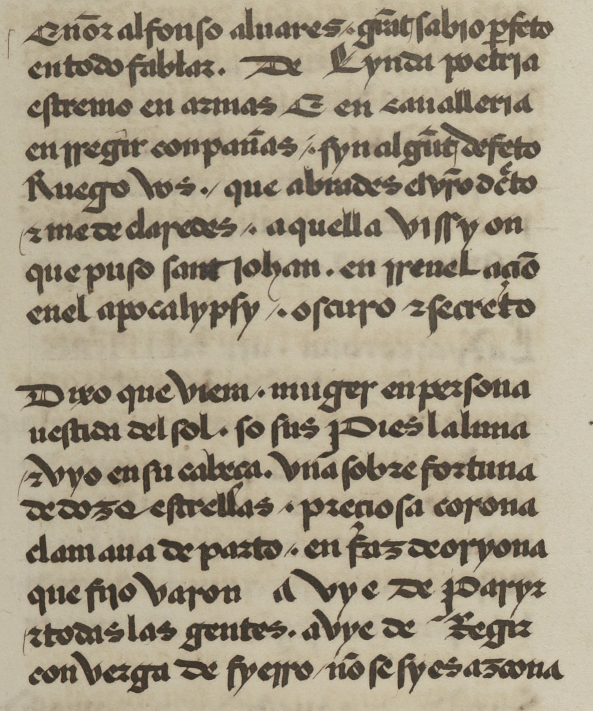
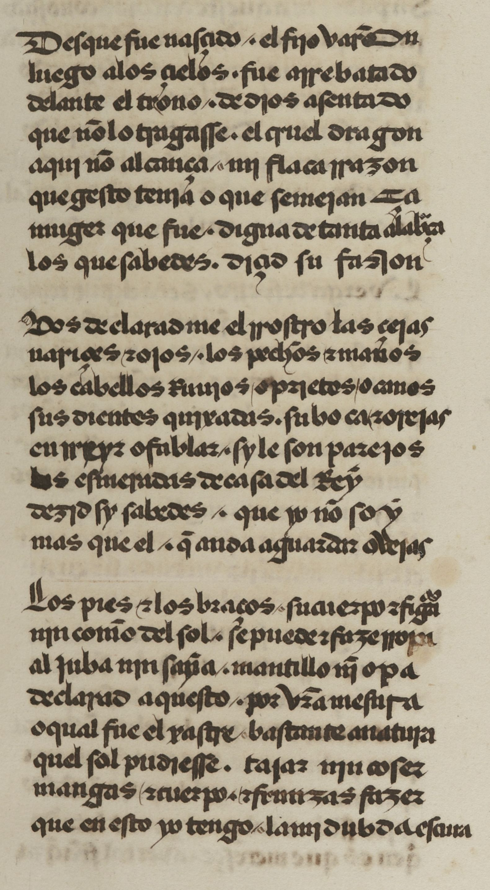
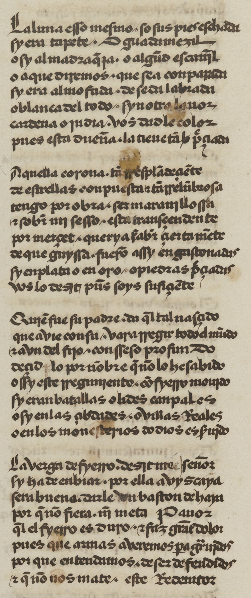

* Autor: Pedro de Colunga
* Editor/a: Gimena del Rio
* Repositorio: Biblioteca Nacional de Francia
* Identificador: Dutton 171
* Localización manuscrito: 29v-30r
* Fecha composición: 1426-1465

Rubrica:  Esta pregunta muy sotil e bien fundada fizo e ordenó Frey Pedro de Colunga, de la Órden de los Predicadores, contra el dicho Alfonso Álvarez de Villasandino, rogándole que le declarase algunas figuras oscuras del Apocalipsis, la cual pregunta dize en esta manera

Se trata de una pieza de arte mayor

> Señor Alfonso Álvarez, grant sabio perfeto,
> en todo fablar de linda poetría,
> estremo en armas e en cavallería
> en regir conpañas sin algún defeto
> ruego vos que abrades el vuestro decreto
> e me declaredes aquella vissión
> que puso Sant Johan en revelación
> en el Apocalipſi oscuro e secreto.

> Dixo que viera muger en persona
> vestida del sol so sus pies la luna,
> e vio en su cabeça una sobre fortuna
> de doze estrellas preciosa corona
> clamava de parto en faz de Oriona
> que fijo varón avié de parir
> e todas las gentes avié de regir
> con verga de fierro, non sé si es Azcona.

> Desque fue nacido el fijo varón
> luego a los cielos fue arrebatado
> delante el trono de Dios asentado
> que non lo tragasse el crüel dragón
> aquí non alcança mi flaca razón
> que gesto tenía o que semejança
> muger que fue digna de tanta alabança
> los que sabedes dicid su fazión.

> Vos declaradme el rostro, las cejas,
> narices e ojos, los pechos e manos,
> los cabellos ruvios o prietos o canos,
> ſus dientes, quixadas, su boca e orejas,
> en reír o fablar si le son parejas
> las esmeradas de casa del Rey
> dezid si sabedes que yo non sey
> más que el que anda a guardar ovejas.

> Los pies e los braços, su cuerpo e figura
> nin como del sol se puede e faze ropa
> aljuba nin saya, mantillo nin opa,
> declarad aquesto por vuestra mesura
> o cuál fue el xastre bastante a natura
> qu’ el sol pudiesse tajar nin coser
> mangas e cuerpo e frunzas fazer
> que en esto yo tengo la mi dubda escura.

> La luna esso mesmo so sus pies echada
> si era tapete o guadamezil
> o si almadraqueja o algund escañil
> o a que diremos que sea comparada
> si era almofada de seda labrada
> o blanca del todo sin otro lavor,
> cardena o judía, vos dadle color,
> pües esta dueña la tiene tan preciada.

> Aquella corona tan resplandeciente
> de estrellas compueſta e tan relunbrosa
> tengo por obra ser maravillossa
> e sobre mi sesso esta transcendente
> por mercet quería saber ciertamente
> de que guissa fueron assí engastonadas
> si en plata o en oro o piedras preciadas
> vos lo dezit pues sois suficiente.

> Quien fue su padre daquel tal nacido
> que avié con su vara rregir todo el mundo
> e aún del fijo con sesso profundo
> decid lo por nombre que non lo he sabido
> o si este regimiento con fierro movido
> si eran batallas o lides campales
> o si en las cibdades o villas reales
> o en los monesterios do Dios es servido.

> La verga de fierro, dezit me señor,
> si ha de enviar por ella a Vizcaya
> será bueno darle un bastón de haya
> por que non fiera nin meta pavor
> quel fierro es duro e faz grant dolor
> pues que armas averemos para guarnidos
> por que entendamos de ser defendidos
> e que non nos mate este Redentor.

